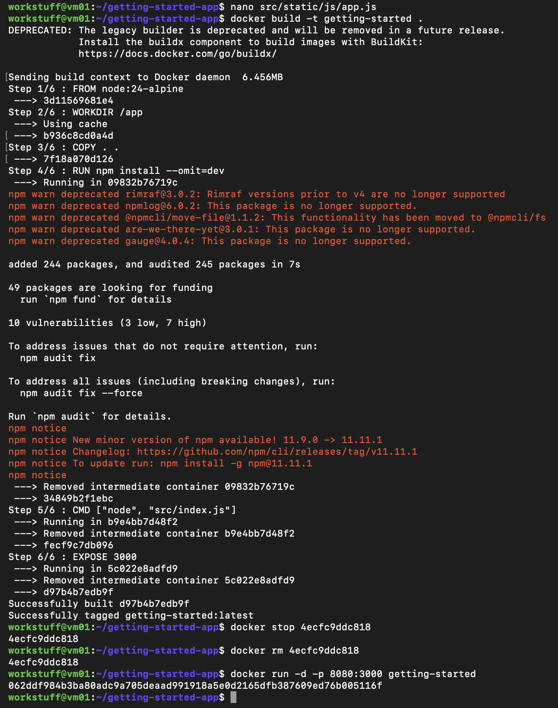
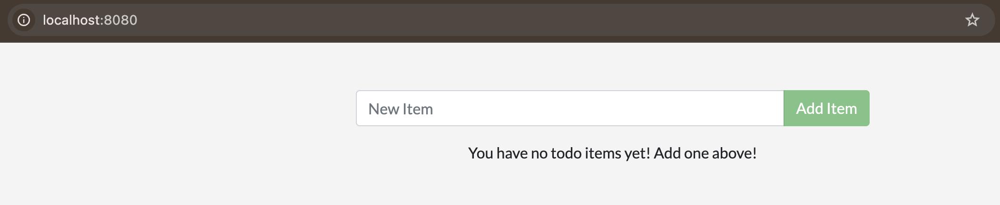

# Part 2 – Updating the Application

## Overview

In this section, I followed the next stage of the Docker “Getting Started” tutorial to update the application source code and rebuild the container image.

This demonstrated how changes to the application require rebuilding the Docker image and redeploying the container, rather than updating a running container directly.

---

## Steps

### 1. Updating the Application Source Code

I navigated to the application directory on the VM and opened the main frontend file using `nano`:

```bash
nano src/static/js/app.js
```

I modified the default empty-state message displayed in the application.

---

### 2. Rebuilding the Docker Image

After saving the changes, I rebuilt the Docker image:

```bash
docker build -t getting-started .
```

This step packages the updated source code into a new image.

During the build process, several warnings appeared related to deprecated npm packages. These did not prevent the build from completing successfully.

---

### 3. Stopping and Removing the Existing Container

Because the existing container was still running on port 8080, it needed to be stopped before running the updated version:

```bash
docker stop 4ecfc9ddc818
docker rm 4ecfc9ddc818
```

This avoids port conflicts when starting a new container.

---

### 4. Running the Updated Container

I then started a new container using the rebuilt image:

```bash
docker run -d -p 8080:3000 getting-started
```

This launched the updated version of the application.



---

### 5. Verifying the Update

Using the SSH tunnel established earlier, I accessed the application in the browser:

```text
http://localhost:8080
```

The updated message was successfully displayed.



---

## Key Learnings

This section demonstrated how application updates are handled in a containerised environment. Rather than modifying a running container, the correct workflow is to:

- update the source code  
- rebuild the Docker image  
- stop and remove the old container  
- run a new container from the updated image  

This reinforces the concept that containers are treated as immutable in practice, with changes applied by rebuilding images and replacing containers rather than modifying them in place.


[Continue to next part](Part 2.md)
