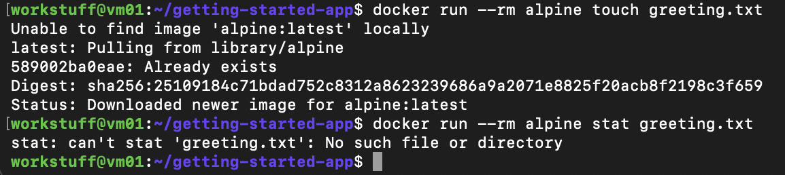
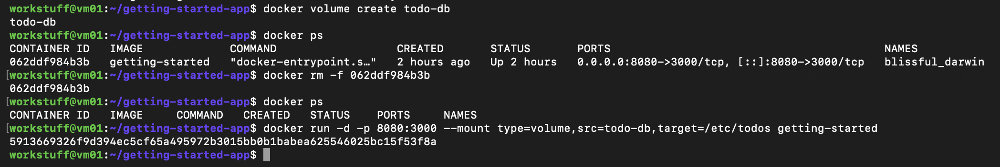
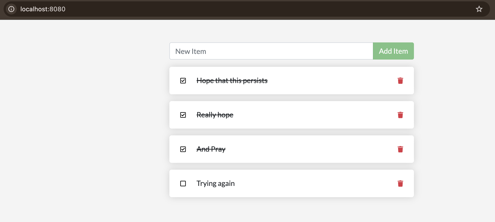
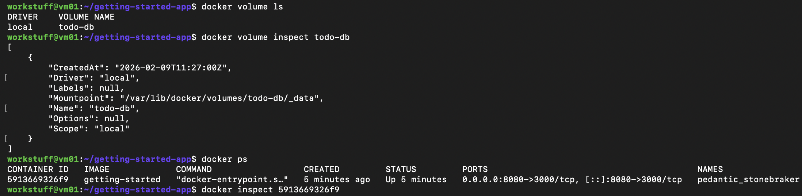
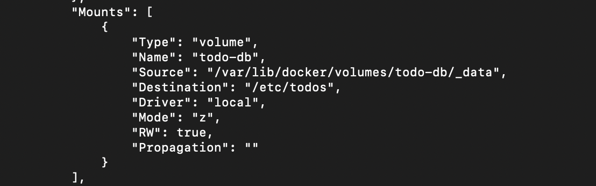
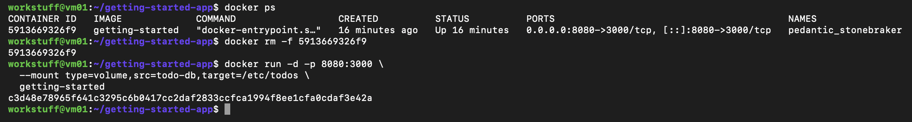
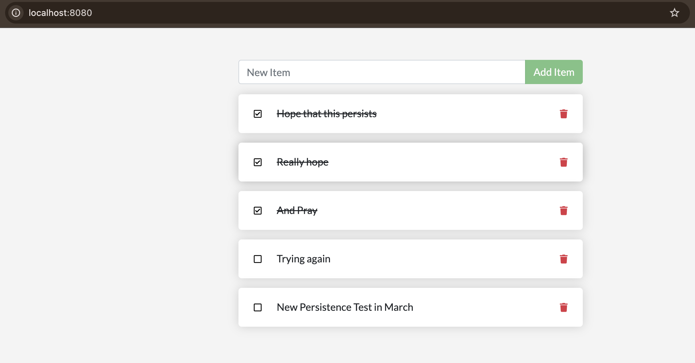

# Part 4 – Persisting Data

## Overview

In this section, I followed the Docker “Getting Started” tutorial to explore how data persistence works in containers.

By default, containers are ephemeral, meaning that any data created inside them is lost when the container is removed. This section demonstrates how Docker volumes can be used to persist data beyond the lifecycle of a container.

---

## Steps

### 1. Demonstrating Non-Persistent Data

To demonstrate that container data does not persist by default, I ran a temporary Alpine container to create a file:

```bash
docker run --rm alpine touch greeting.txt
```

I then attempted to access the same file in a new container:

```bash
docker run --rm alpine stat greeting.txt
```

The file could not be found, confirming that data created inside a container is not persisted between runs.



---

### 2. Creating a Named Volume

I created a Docker volume to store application data:

```bash
docker volume create todo-db
```

This volume exists independently of any container and is used to persist data.

---

### 3. Running the Application with a Volume

I stopped and removed the existing container and started a new one with the volume mounted:

```bash
docker rm -f <container_id>

docker run -d -p 8080:3000 \
  --mount type=volume,src=todo-db,target=/etc/todos \
  getting-started
```



---

### 4. Observing Unexpected Persisted Data

When I opened the application, I noticed that previous todo items from an earlier session (over a month ago) were already present.



This occurred because the volume `todo-db` already existed and contained previously stored data. Even though I had restarted the tutorial and recreated containers, Docker reused the same volume, demonstrating that volumes persist independently of containers.

---

### 5. Inspecting the Volume and Container Mount

To better understand where the data was stored, I inspected the volume:

```bash
docker volume ls
docker volume inspect todo-db
```



The output showed that the data was stored on disk at:

```
/var/lib/docker/volumes/todo-db/_data
```

I also inspected the running container:

```bash
docker inspect <container_id>
```



This confirmed that the volume `todo-db` was mounted to `/etc/todos` inside the container, which is where the application stores its data.

---

### 6. Verifying Data Persistence

To explicitly demonstrate persistence, I added a new todo item through the application interface.

I then removed the container:

```bash
docker rm -f <container_id>
```



Next, I started a new container with the same volume mounted:

```bash
docker run -d -p 8080:3000 \
  --mount type=volume,src=todo-db,target=/etc/todos \
  getting-started
```

When I reopened the application, the newly added item was still present.



This confirms that the data was stored in the volume and not in the container itself.

---

## Key Learnings

This section demonstrated the difference between ephemeral container storage and persistent storage using Docker volumes.

- data created inside a container is lost when the container is removed  
- Docker volumes allow data to persist independently of containers  
- volumes can be reused across multiple container instances  
- inspecting volumes reveals where data is stored on the host system  

The unexpected reappearance of older todo items highlighted that volumes persist across sessions, reinforcing the importance of understanding how Docker manages data outside of containers.

[Continue to next part](<Part 5.md>)
