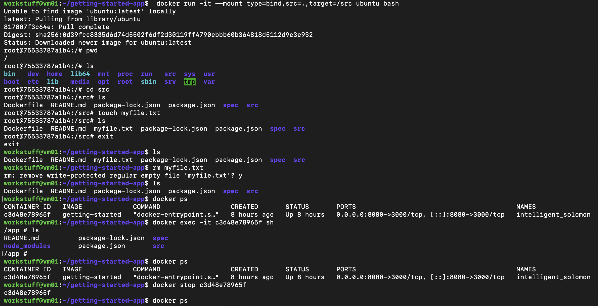
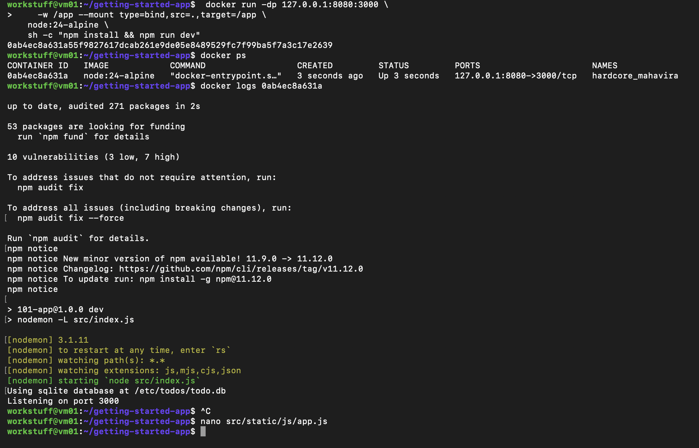
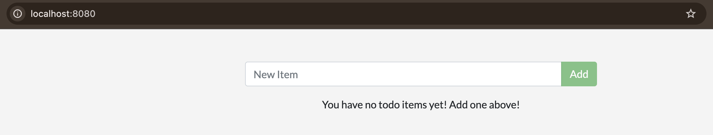

# Part 5 – Using Bind Mounts for Development

## Overview

In this section, I explored the use of bind mounts to enable live development within a Docker container. Bind mounts allow files on the host machine to be directly shared with the container, meaning changes can be applied instantly without rebuilding the image.

---

## Demonstrating File Synchronisation

To verify that the bind mount was working, I created a file inside the container and confirmed that it appeared on the host machine. I then deleted the file from the host and observed that it was also removed from the container.

This demonstrates that bind mounts provide bidirectional file sharing between the host and container.



---

## Running the Application with a Bind Mount

I started the container using a bind mount and nodemon:

```bash
docker run -dp 127.0.0.1:8080:3000 \
  -w /app --mount type=bind,src=.,target=/app \
  node:24-alpine \
  sh -c "npm install && npm run dev"
```

This configuration:
- mounts the current project directory into `/app` inside the container
- runs the application using `nodemon` for automatic restarts
- exposes the app on port 8080



---

## Live Reload with Nodemon

I modified the application source code by changing the button text from “Add Item” to “Add” in:

```text
src/static/js/app.js
```

After saving the file, the change was immediately reflected in the running application without rebuilding the image.

This worked because:
- the bind mount made the updated file instantly available inside the container
- nodemon detected the file change and automatically restarted the application



---

## Observing Data Persistence Behaviour

After making the UI change and confirming it worked, I also added a new todo item to the application. However, after stopping the container, rebuilding the image, and running a new container, I noticed that:

- The UI change (“Add” instead of “Add Item”) remained
- The todo item I had added was no longer present

This highlighted an important distinction between application code and application data in Docker.

The UI change persisted because it had been written into the Docker image during the build process. In contrast, the todo data did not persist because the container was not using a volume to store its database.

In an earlier part of the tutorial, I had used a named volume:

```bash
--mount type=volume,src=todo-db,target=/etc/todos
```

This allowed the database file (`/etc/todos/todo.db`) to persist outside the container, meaning that data remained even after the container was removed and recreated.

In this section, however, I was using a bind mount only for the application source code, and no volume was attached for the database. As a result, the database existed only within the container’s filesystem and was lost when the container was removed.

This demonstrates a key concept:
- Bind mounts are useful for live code editing during development
- Volumes are required for persistent application data

---

## Key Learning

Bind mounts are extremely useful for development because they allow:
- real-time file updates
- rapid iteration without rebuilding images
- seamless integration between host and container environments

However, this setup is not suitable for production, as it depends on the host file system. For deployment, a Docker image must be rebuilt to include all changes.

[Continue to next part](<Part 6.md>)
