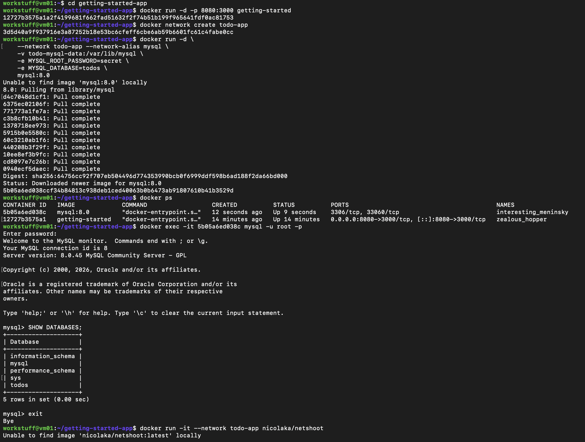
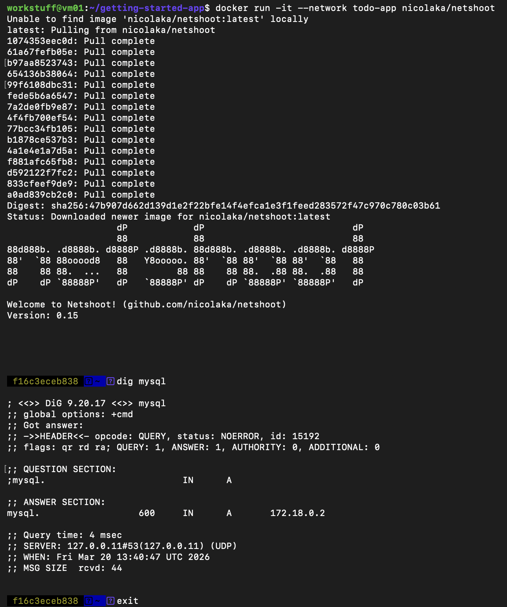
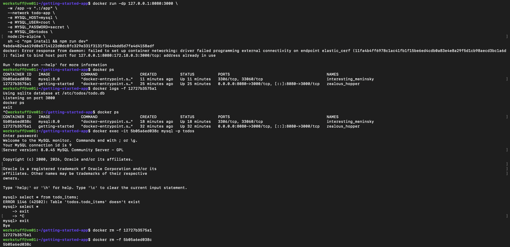
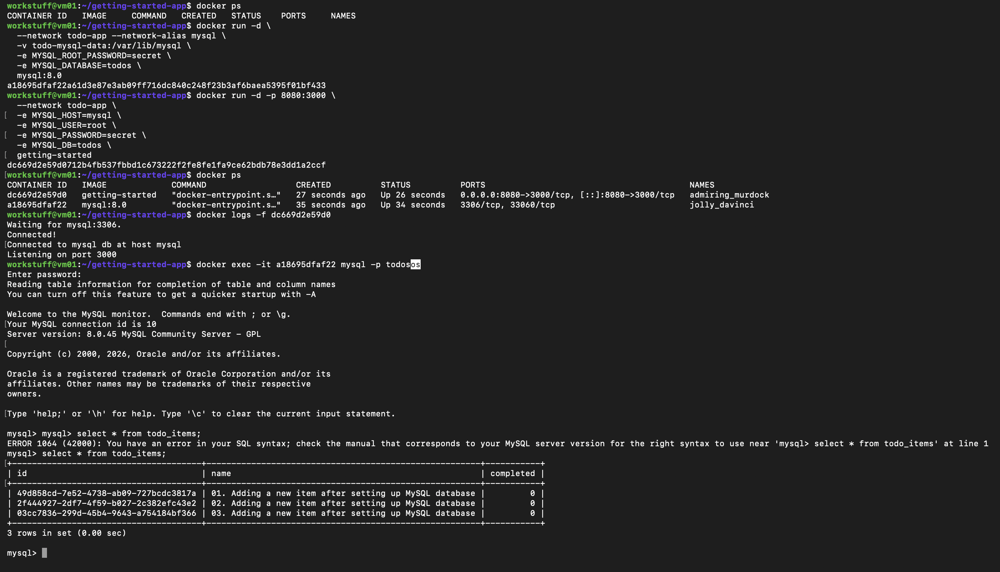
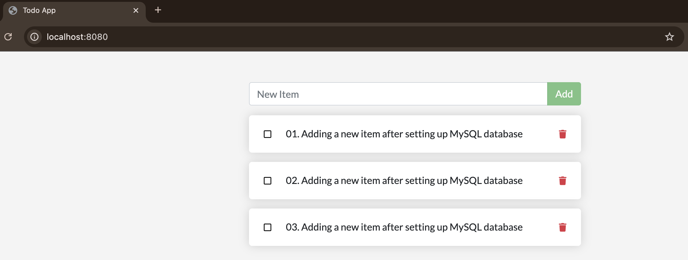

# Part 6 – Multi-Container Applications

## Overview

In this section, I extended the application to use a multi-container architecture by introducing a MySQL database alongside the existing app container. The goal was to replace the default SQLite database with MySQL and enable communication between containers using a Docker network.

---

## Creating a Network

To allow containers to communicate, I created a Docker network:

```bash
docker network create todo-app
```

This network allows containers to reference each other by name.

---

## Starting the MySQL Container

I then started the MySQL container and attached it to the network:

```bash
docker run -d \
  --network todo-app --network-alias mysql \
  -v todo-mysql-data:/var/lib/mysql \
  -e MYSQL_ROOT_PASSWORD=secret \
  -e MYSQL_DATABASE=todos \
  mysql:8.0
```



- `--network-alias mysql` allows other containers to connect using the hostname "mysql"  
- The volume ensures database persistence  

---

## Verifying Network Connectivity

To confirm that containers could communicate over the network, I used a diagnostic container:

```bash
docker run -it --network todo-app nicolaka/netshoot
```

Inside it, I ran:

```bash
dig mysql
```

This returned the IP address of the MySQL container, confirming successful DNS resolution within the network.



---

## Issue Encountered – Port Conflict and Incorrect Container

While attempting to start the app configured for MySQL, I encountered an issue.

Docker returned:

```text
failed to bind host port for 127.0.0.1:8080: address already in use
```

At the same time, the following container was still running:

```text
0.0.0.0:8080->3000/tcp
```



Additionally, checking the logs showed:

```text
Using sqlite database at /etc/todos/todo.db
```

This revealed that:
- An older app container was still running  
- It was already using port 8080  
- It was still configured to use SQLite  

Because of this, the new MySQL-configured container could not start properly, and the application being served was still the old version.

---

## Fix – Removing Old Containers

To resolve the issue, I removed both the old app container and the MySQL container, and then restarted them with the correct configuration.

---

## Running the App with MySQL

I then started both containers correctly:

```bash
docker run -d \
  --network todo-app --network-alias mysql \
  -v todo-mysql-data:/var/lib/mysql \
  -e MYSQL_ROOT_PASSWORD=secret \
  -e MYSQL_DATABASE=todos \
  mysql:8.0

docker run -d -p 8080:3000 \
  --network todo-app \
  -e MYSQL_HOST=mysql \
  -e MYSQL_USER=root \
  -e MYSQL_PASSWORD=secret \
  -e MYSQL_DB=todos \
  getting-started
```

The logs now showed:

```text
Waiting for mysql:3306.
Connected!
Connected to mysql db at host mysql
```



---

## Verifying Data in MySQL

After adding items through the UI, I confirmed that the data was stored in MySQL:

```sql
select * from todo_items;
```

This returned the inserted rows:



---

## Key Learning

This section demonstrated how multiple containers can work together using Docker networking.

- Containers communicate using a shared network and hostnames  
- Environment variables configure connections between services  
- Port conflicts can prevent new containers from starting correctly  
- Old containers must be removed when changing architecture  
- The database layer can be cleanly separated from the application  

The issue encountered was particularly valuable, as it highlighted that Docker does not automatically replace running containers, and that logs are essential for diagnosing which container is actually serving the application.
