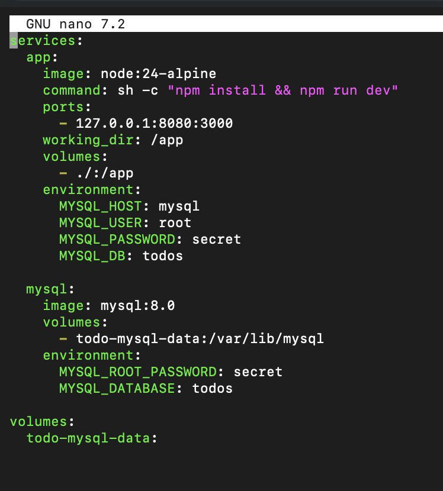
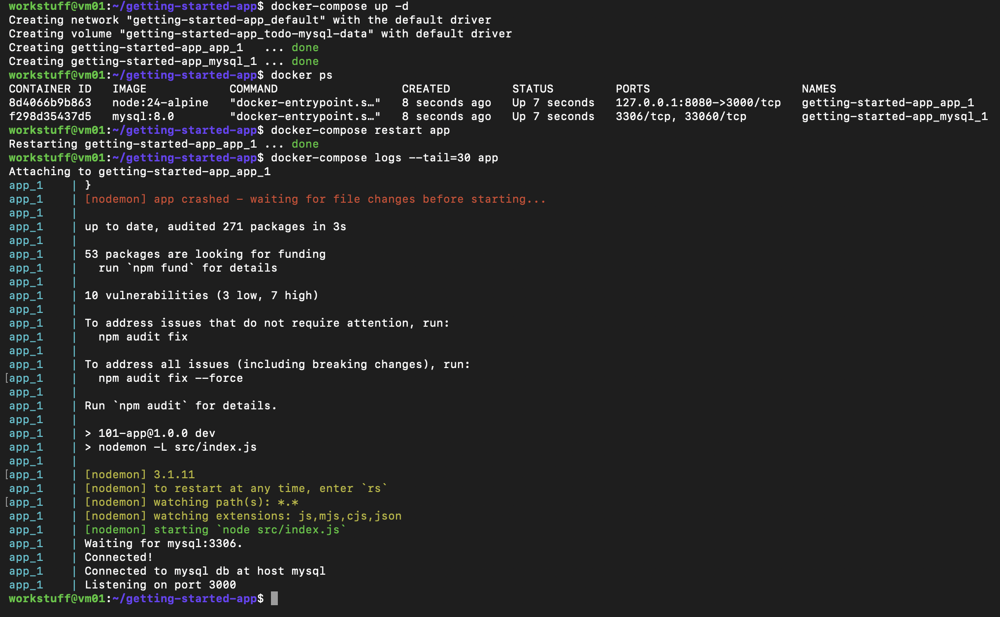
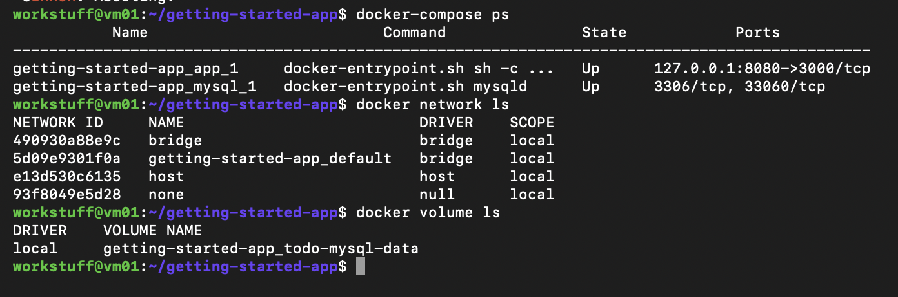
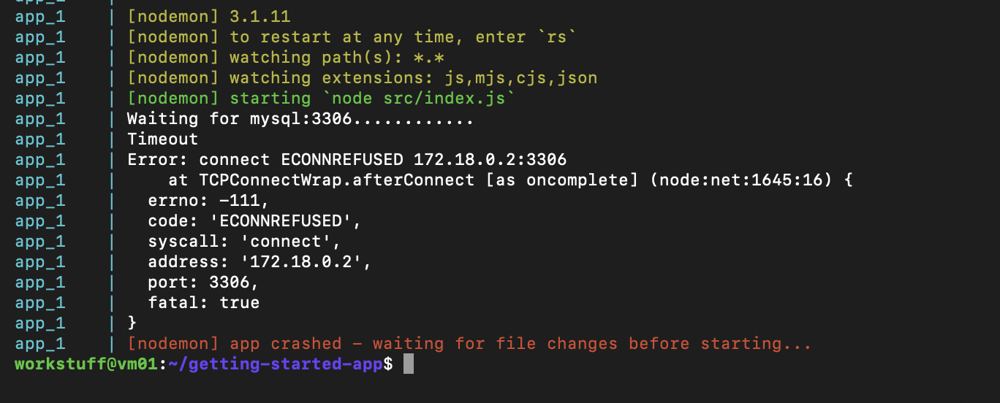
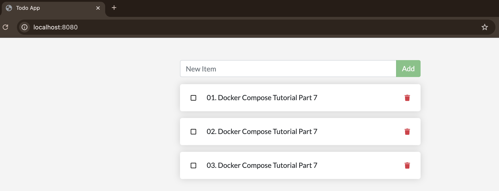
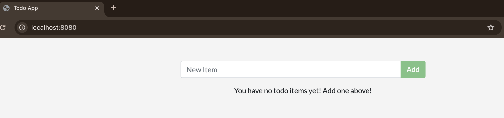
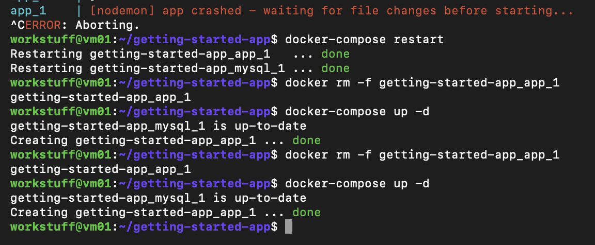
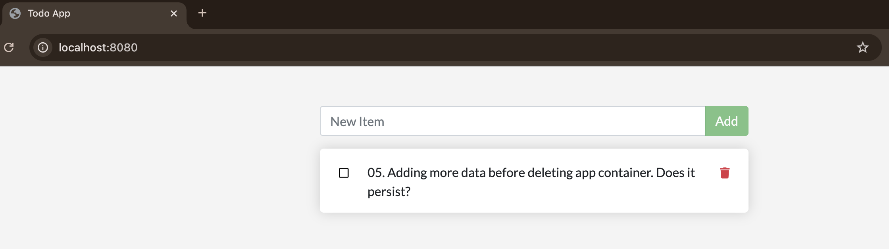
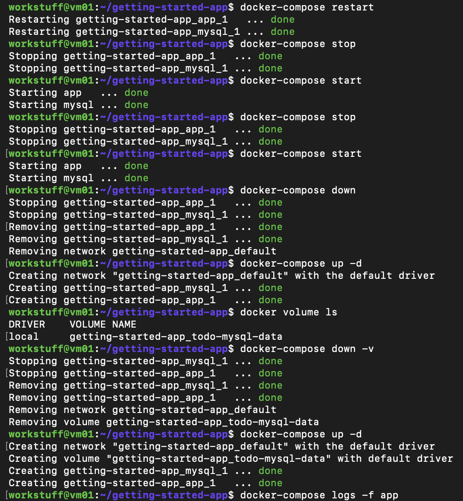

# Part 7 – Multi-Container Application with Docker Compose

## Overview

In this section, a multi-container application was created using Docker Compose. The application consists of two services:

- A Node.js application (app)
- A MySQL database (mysql)

Docker Compose was used to define, run, and manage both services together as a single application stack.

---

## Docker Compose Configuration

A compose.yaml file was created in the project directory with the following configuration:

- The app service:
  - Uses the node:24-alpine image
  - Runs npm install and starts the development server
  - Maps port 8080 (host) to 3000 (container)
  - Mounts the project directory into the container
  - Connects to the MySQL service using environment variables

- The mysql service:
  - Uses the mysql:8.0 image
  - Stores data in a named Docker volume (todo-mysql-data)
  - Sets up a database named todos

- A named volume (todo-mysql-data) is defined to persist database data outside the container lifecycle



---

## Running the Application

The application stack was started using:

    docker-compose up -d

This resulted in:

- Creation of a dedicated network: getting-started-app_default
- Creation of a named volume: getting-started-app_todo-mysql-data
- Startup of two containers:
  - getting-started-app_app_1
  - getting-started-app_mysql_1

Verification using:

    docker-compose ps
    docker network ls
    docker volume ls

confirmed that all components were running as expected.





---

## Initial Issue Encountered

On first run, the application failed to start correctly. Logs showed:

- The Node.js app attempted to connect to MySQL
- The connection failed with an ECONNREFUSED error

This occurred because the MySQL container was not yet fully ready when the application attempted to connect.



---

## Resolution

After restarting the application container:

    docker-compose restart app

the connection succeeded:

- MySQL finished initialisation
- The app successfully connected to the database
- The server began listening on port 3000


---

## Application Architecture (Observed)

The Compose setup automatically created:

- A shared Docker network allowing services to communicate using service names (mysql)
- A persistent volume for database storage
- Clearly named containers following the pattern:

    <project-name>_<service-name>_<instance>

Examples:

- getting-started-app_app_1
- getting-started-app_mysql_1

## Testing

In this section, I explored how Docker volumes affect data persistence in a multi-container application. The goal was to understand what happens to application data when containers are stopped, removed, and recreated.

---

## Initial State – Existing Todo Items

Before testing persistence, I confirmed that the application contained existing todo items.



This establishes a baseline to compare against after containers are restarted or removed.

---

## Restarting Containers

I first tested what happens when containers are simply restarted.

```bash
docker-compose restart
```

### Result

- All existing todo items remained visible.
- No data loss occurred.

This shows that restarting containers does not affect stored data.

---

## Stopping and Starting Containers

Next, I tested stopping and starting the containers.

```bash
docker-compose stop
docker-compose start
```

### Result

- The application still retained all todo items.
- Data remained intact.

This confirms that stopping containers does not remove stored data.

---

## Removing Containers (Without Volumes)

Next, I removed all containers but left the volume intact.

```bash
docker-compose down
docker-compose up -d
```

### Result

- The application still displayed all previously added todo items.

### Explanation

Even though both containers were removed, the Docker volume storing the database data was preserved. When the containers were recreated, they reconnected to the same volume.

---

## Verifying the Volume

To confirm that a volume was being used, I listed all Docker volumes:

```bash
docker volume ls
```

### Result

The following volume was present:

getting-started-app_todo-mysql-data

This confirms that MySQL data is stored outside the container.

---

## Removing Containers and Volumes

Next, I removed both the containers and the associated volume:

```bash
docker-compose down -v
docker-compose up -d
```

### Result

- The application started with no todo items.



### Explanation

The `-v` flag removes the volume along with the containers. Since the volume stores the database data, deleting it results in permanent data loss.

## Adding New Data After Reset

After removing the volume, I added a new todo item to confirm the app was functioning normally again.

This demonstrates that the application continues to work correctly after a full reset, but starts from a clean state.

---

## Removing Only the App Container

To isolate behaviour further, I removed only the application container while leaving the database container and volume untouched.

```bash
docker rm -f getting-started-app_app_1
docker-compose up -d
```


### Result

- The app container was recreated.
- All existing todo items were still present.



### Explanation

The application container is stateless and does not store data itself. The MySQL container stores its data in a Docker volume. When the app container is removed and recreated, it reconnects to the same database container and volume, so no data is lost.

---

## Additional Observations (Terminal Logs)

The following commands were used throughout testing:

```bash
docker-compose restart
docker-compose stop
docker-compose start
docker rm -f getting-started-app_app_1
docker-compose down
docker-compose up -d
docker-compose down -v
docker volume ls
```



These logs confirm:

- Containers can be removed and recreated independently
- The app container does not hold persistent data
- Volumes persist unless explicitly deleted
- Removing volumes resets application data

---

## Key Learnings

- Docker Compose enables multiple services to run as a single, networked application using simple configuration  
- Services communicate via built-in networking, removing the need for manual connection setup  
- Data persistence is handled through named volumes, which exist independently of containers  
- Containers are disposable: they can be stopped, removed, or recreated without affecting stored data  
- The application layer is stateless, while the database layer is stateful and relies on volumes  
- Data is only permanently lost when the underlying volume is explicitly removed  

---

## Conclusion

This section demonstrated how Docker Compose manages both application logic and data storage in a multi-container environment. By separating stateless services from persistent data, it allows containers to be recreated freely while maintaining application state through volumes.
